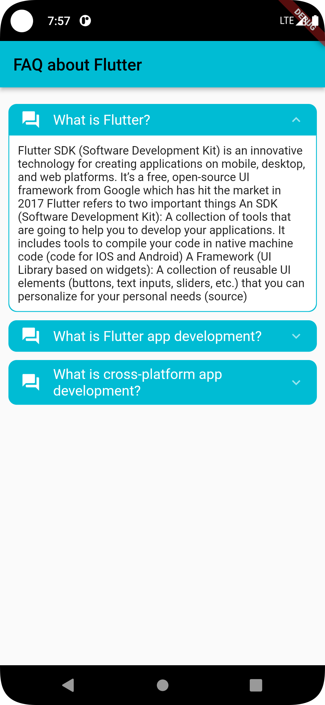

# FlutterFaqSample

Faq - question and answer sample design and implementation in flutter. if you want clone or fork it.


## FrameWork
1. Flutter

## Language:
1. Dart

## Tools:
1. Git
2. Android studio / Vscode

## Pre-requirement:
1. Flutter 3.3.10
2. Dart 2.18.6
3. accordion: ^2.0.1

# Cli command
## check your flutter support info:

```
flutter doctor
```
## dependancy install / package install:
```
flutter pub get
```
## Run methods:
```
flutter run
```
### ✌&ensp;Preview

|                Preview                 | 
|:--------------------------------------:|
|  | 

## Reference:
* https://www.fluttercampus.com/guide/334/add-accordion-flutter/